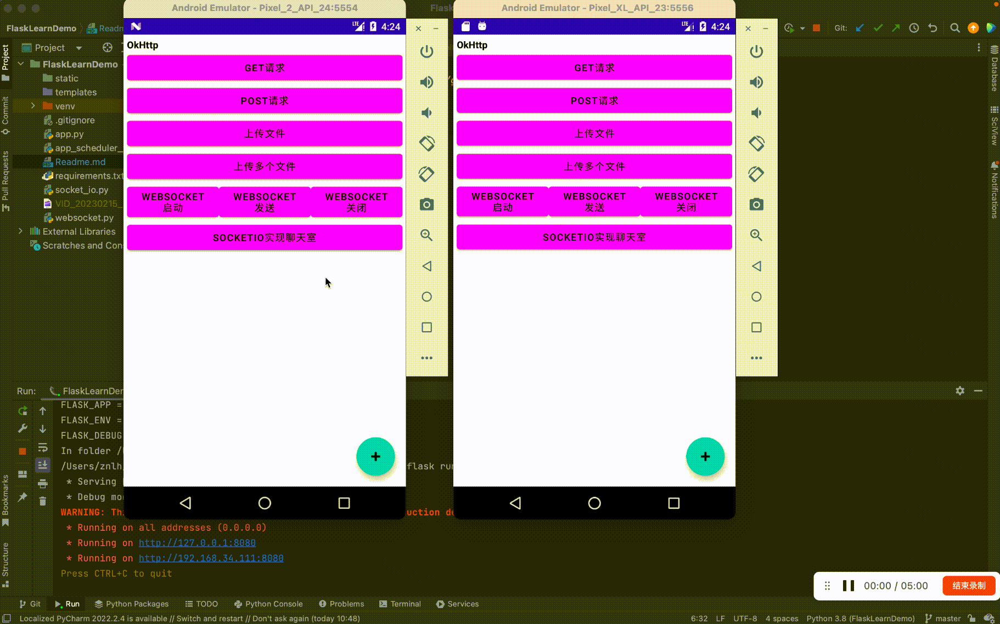

# Android学习demo
## 网络相关

后端代码，点[这里](https://github.com/LuckyLi706/FlaskLearnDemo)

### [OkHttp](https://github.com/square/okhttp)
```groovy
//网络okhttp
implementation("com.squareup.okhttp3:okhttp:4.10.0")
implementation 'com.squareup.okhttp3:logging-interceptor:3.10.0'
```

+ [GET和POST请求](app/src/main/java/com/lucky/androidlearndemo/ui/activity/network/NetworkActivity.java)
+ [上传单个和多个文件](app/src/main/java/com/lucky/androidlearndemo/ui/activity/network/NetworkActivity.java)
+ [WebSocket](app/src/main/java/com/lucky/androidlearndemo/ui/activity/network/NetworkActivity.java)

### [SocketIo](https://socket.io/docs/v4/)

+ [socketio 安卓官网](https://socketio.github.io/socket.io-client-java/android.html)

+ [engine.io-client-java](https://github.com/socketio/engine.io-client-java)
+ [socket.io-client-java](https://github.com/socketio/socket.io-client-java)

```groovy
//socketio
implementation ('io.socket:socket.io-client:2.1.0') {
   exclude group: 'org.json', module: 'json'
}
implementation ('io.socket:engine.io-client:2.1.0') {
   // excluding org.json which is provided by Android
   exclude group: 'org.json', module: 'json'
}
```

+ [socketio实现的聊天室](app/src/main/java/com/lucky/androidlearndemo/ui/activity/network/SocketIoActivity.java)

